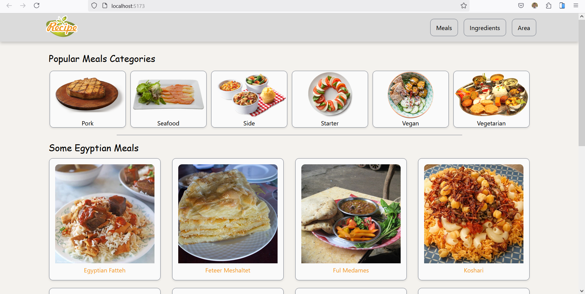
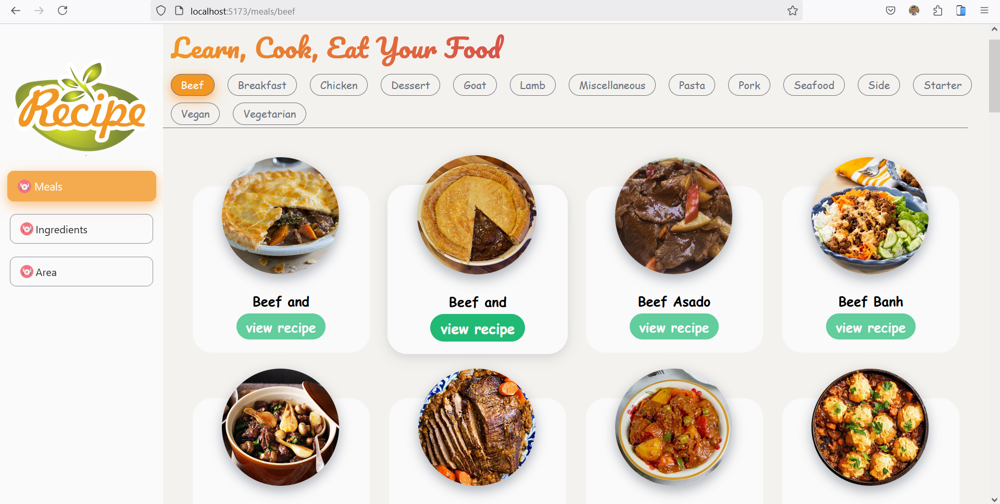
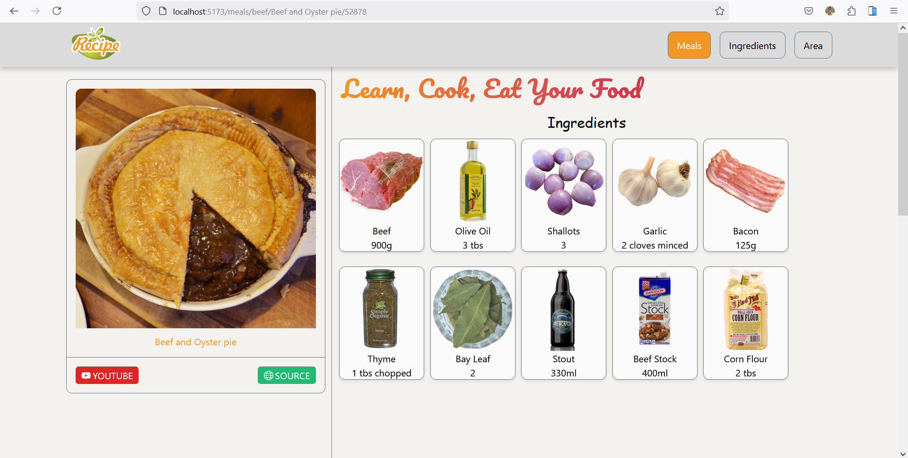

# Learn, Cook, Eat Your Food

This project is a web application that displays a list of Meals. The app uses the [themealdb Database API](https://www.themealdb.com/api.php) to fetch meals, ingredients and Instructions.





## Features

- Display a list of meals and ingredients .
- Filter meals by category or area.
- View detailed information about each meal, including screenshots of ingredients and Instructions.
- Interactive and user-friendly interface.
- Routing between pages using React Router.
- Built with `React` and `React Router`.

## Technologies Used

- [React](https://reactjs.org/)
- [React Router](https://reactrouter.com/)
- [Axios](https://axios-http.com/)
- [Sass](https://sass-lang.com/)
- [Aos](https://michalsnik.github.io/aos/)

## How to Run

1. Download or clone the project:

   ```bash
   git clone https://github.com/your-username/your-repo-name.git

## Project Structure
1. src/components/: Contains React components like Home, Meals, and Details.
2. src/context/: Contains ContextAPIProvider.jsx, which manages the app state and fetches data from the API.
3. src/assets/: Contains images and other assets used in the app.
4. src/App.js: The main file that handles routing between pages.
5. src/index.js: The entry point of the application.

## Dependencies
   1. axios: For fetching data from the API.
   2. sass: For styling the UI.
   3. react-slick: For make slider.
   4. AOS animations: For animation.
   5. Vite + react: For building the user interface.
   6. react-router-dom: For managing routing between pages.